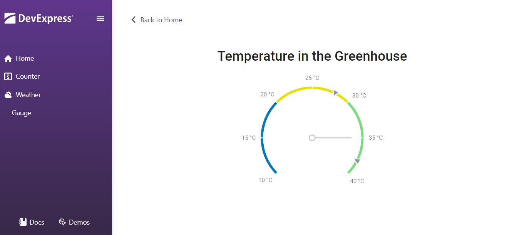

<!-- default badges list -->

[](https://supportcenter.devexpress.com/ticket/details/T1069428)
[](https://docs.devexpress.com/GeneralInformation/403183)
[](#does-this-example-address-your-development-requirementsobjectives)
<!-- default badges end -->
# Blazor - Use DevExtreme Circular Gauge in a Blazor Application

This example shows how to embed [DevExtreme widgets](https://js.devexpress.com/Demos/WidgetsGallery/) into your Blazor application.




## Implementation Details

DevExtreme widgets require DevExtreme scripts and stylesheets. The DevExpress [Resource Manager](https://docs.devexpress.com/Blazor/DevExpress.Blazor.DxResourceManager) automatically registers the DevExtreme script if your project includes the *DevExpress.Blazor* package. To add DevExtreme stylesheets, reference them in the *App.razor* file:


```Razor
<head>
    <link href=@AppendVersion("https://cdn3.devexpress.com/jslib/24.2.3/css/dx.common.css") rel="stylesheet" />
    <link href=@AppendVersion("https://cdn3.devexpress.com/jslib/24.2.3/css/dx.material.purple.light.compact.css") rel="stylesheet" />
    <!-- ... -->
</head>

@code{
    private string AppendVersion(string path) => FileVersionProvider.AddFileVersionToPath("/", path);
}
```

_DevExtremeGauge.razor_ and _DevExtremeGauge.razor.js_ files wrap the DevExtreme [Circular Gauge](https://js.devexpress.com/Demos/WidgetsGallery/Demo/Gauges/Overview/jQuery/Light/) widget. During the wrapper's first render, the wrapper executes the [LoadDxResources](https://docs.devexpress.com/Blazor/DevExpress.Blazor.DxResourceManager.LoadDxResources(Microsoft.JSInterop.IJSRuntime)?v=24.2) method to force the Resource Manager to load all client scripts:

```csharp
protected override async Task OnAfterRenderAsync(bool firstRender) {
    if(firstRender) {
        await JS.LoadDxResources();
        ClientModule = await JS.InvokeAsync<IJSObjectReference>("import", "./DevExtremeComponents/DevExtremeGauge.razor.js");
        ClientGauge = await ClientModule.InvokeAsync<IJSObjectReference>("initializeGauge", Gauge, DataSource);
    }
    await base.OnAfterRenderAsync(firstRender);
}
```

You can use the wrapper as a regular Blazor component. The following code adds a `DevExtremeGauge` wrapper component to a page:

```Razor
<DevExtremeGauge />
```

The DevExpress Blazor UI Component Library includes multiple DevExtreme-based components (for example, [DxHtmlEditor](https://docs.devexpress.com/Blazor/DevExpress.Blazor.DxHtmlEditor) or [DxMap](https://docs.devexpress.com/Blazor/DevExpress.Blazor.DxMap)). Refer to class descriptions for more information.

## Files to Review

* [DevExtremeResources.razor](./CS/DxtGaugeInBlazor/DevExtremeComponents/DevExtremeGauge.razor)
* [DevExtremeResources.razor.js](./CS/DxtGaugeInBlazor/DevExtremeComponents/DevExtremeGauge.razor.js)
* [DevExtremeGauge.razor](./CS/DxtGaugeInBlazor/Components/Pages/Gauge.razor)
* [App.razor](./CS/DxtGaugeInBlazor/Components/App.razor)

## Documentation

[Add JavaScript-Based Components to an Application](https://docs.devexpress.com/Blazor/403578/common-concepts/add-js-components-to-application)
<!-- feedback -->
## Does this example address your development requirements/objectives?

[](https://www.devexpress.com/support/examples/survey.xml?utm_source=github&utm_campaign=blazor-use-devextreme-circular-gauge&~~~was_helpful=yes) [](https://www.devexpress.com/support/examples/survey.xml?utm_source=github&utm_campaign=blazor-use-devextreme-circular-gauge&~~~was_helpful=no)

(you will be redirected to DevExpress.com to submit your response)
<!-- feedback end -->
